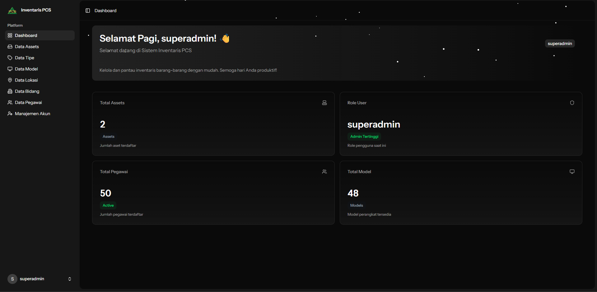

# Guide to Aset Inventarisasi Project

## Table of Contents
- [Description](#description)
- [Features](#features)
- [Tech Stack Used](#tech-stack-used)
- [Prerequisites](#prerequisites)
- [Installation and Setup](#installation-and-setup)
- [Access the Application](#access-the-application)
- [Default Credentials](#default-credentials)
- [Struktur Project](#struktur-project)
- [Screenshots](#screenshots)
- [Demo](#demo)
- [Additional Notes](#additional-notes)

## Description
Selamat datang di project Inventaris PCS! Aplikasi ini dirancang untuk membantu dalam pengelolaan inventaris aset perusahaan Anda dengan efisien. Dengan fitur-fitur seperti penambahan aset, pelacakan lokasi, dan manajemen pengguna, aplikasi ini bertujuan untuk menyederhanakan proses inventarisasi aset Anda.

## Features
- Autentikasi Pengguna dengan Role-Based Access Control (RBAC)
- Dashboard Ringkasan Aset
- Manajemen Data Aset
- Manajemen Tipe Aset
- Manajemen Model Aset
- Manajemen Lokasi Aset
- Manajemen Karyawan
- Manajemen Bidang/Unit Organisasi
- Autentikasi dan Otorisasi Pengguna
- Antarmuka Pengguna yang Responsif dan support light/dark mode

## Tech Stack Used
- **Backend**: Laravel 12
- **Frontend**: React dengan Inertia.js dan TypeScript
- **Database**: MySQL (atau database lain yang didukung oleh Laravel)
- **Styling**: Tailwind CSS
- **UI Components**: Shadcn UI

## Prerequisites
Sebelum memulai, pastikan Anda telah menginstal perangkat lunak berikut di sistem Anda:
- PHP >= 8.1
- Composer
- Node.js LTS
- NPM atau Yarn
- Database (MySQL, PostgreSQL, SQLite, dll.)
## Installation and Setup

1. **Clone Repository**
   ```bash
   git clone https://github.com/adenafil/inventaris_pcs.git
   ```

2. **Masuk ke Direktori Project**
   ```bash
   cd inventaris_pcs
   ```

3. **Install Dependencies**
   ```bash
   composer install
   npm install
   ```

4. **Konfigurasi Environment**
   - Salin file `.env.example` menjadi `.env`
   - Sesuaikan konfigurasi database dan pengaturan lainnya di file `.env`

5. **Generate Application Key**
   ```bash
   php artisan key:generate
   ```

6. **Jalankan Migrasi dan Seed Database**
   ```bash
   php artisan migrate --seed --seeder=InitSeeder
   ```
7. **Storage Link**
   ```bash
   php artisan storage:link
   ```

8. **Jalankan Development Server**
   ```bash
   composer run dev
   ```

## Access the Application
Buka browser Anda dan akses aplikasi di `http://localhost:8000`.

## Default Credentials
- **Email**: superadmin@pcs.com
- **Password**: rahasiadong

## Struktur Project
- `app/Http/Controllers/Admin`: Berisi controller untuk mengelola berbagai entitas dalam aplikasi.
- `resources/js/pages`: Berisi komponen React untuk berbagai halaman dalam aplikasi.
- `database/migrations`: Berisi file migrasi database untuk membuat tabel yang diperlukan.
- `database/seeders`: Berisi seeder untuk mengisi data awal ke dalam database.
- `routes/web.php`: Berisi definisi rute web untuk aplikasi.
- `resources/js/components`: Berisi komponen UI yang dapat digunakan kembali di seluruh aplikasi.
- `resources/js/layouts`: Berisi layout utama untuk aplikasi.
- `resources/js/lib`: Berisi utilitas dan helper functions untuk aplikasi.
- dan masih banyak lagi...

## Screenshots



## Demo
A live demo of the application is available at: [https://inventaris-pcs.pedulidonor.icu](https://inventaris-pcs.pedulidonor.icu)

## Additional Notes
- Pastikan server database Anda berjalan sebelum menjalankan migrasi.
- Jika Anda mengalami masalah selama instalasi atau menjalankan aplikasi, periksa log error di `storage/logs/laravel.log` untuk informasi lebih lanjut.
- Jika image storage tidak berfungsi, pastikan Anda telah menjalankan perintah `php artisan storage:link`.
- Jika sudah `php artisan storage:link` tetapi masih tidak bisa, coba cek permission folder `storage` dan `public/storage`, pastikan web server Anda memiliki izin untuk membaca dan menulis ke folder tersebut atau cek di config filesystem di `.env`, pastikan `FILESYSTEM_DRIVER=public`.
- Untuk informasi lebih lanjut tentang penggunaan aplikasi, silakan merujuk ke dokumentasi yang tersedia di dalam project atau hubungi pengembang.

Selamat menggunakan aplikasi inventarisasi aset Anda!